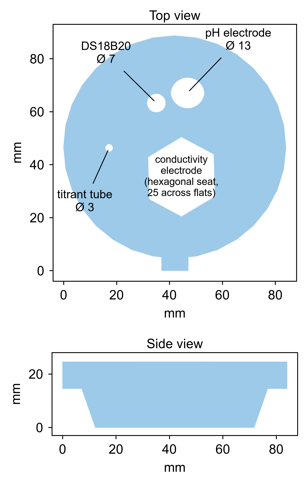

# 3D-printed parts

| File | Part | Triangles | Notes |
|---|---|---:|---|
| `msat-probe-lid.stl` | Probe-mounting lid for the 250 mL titration beaker | 710 | Holds the four probes (pH electrode, conductivity electrode, DS18B20 temperature probe and the titrant delivery tube) in fixed positions over the analyte, and closes the beaker inside the calorimeter enclosure. |

The lid has four openings: a large round hole for the pH electrode, a hexagonal seat for the
conductivity electrode's gland nut, a smaller round hole for the DS18B20 probe and a narrow hole for
the titrant delivery tube.

The TCS34725 color sensor is **not** part of the lid and has no printed mount. It is fixed with
adhesive tape to the inner wall of the expanded-polystyrene calorimeter enclosure, pressed against
the outside of the beaker, and a white LED panel on the opposite side of the beaker shines through
the solution toward it.

## Printing

Printed on a Bambu Lab P2S (Bambu Lab, Shenzhen, China) and sliced with Bambu Studio.

| Setting | Value |
|---|---|
| Material | PETG |
| Approximate material use | 10 g |

PETG was chosen for its chemical resistance to dilute acids, bases and ethanol, and for its
dimensional stability at the temperatures reached during a thermometric titration. PLA is not
recommended: it softens well below the temperatures seen in the enclosure and is attacked by
ethanol.

Any fused-filament printer with a 256 mm build volume or larger will produce this part; the
specific printer and slicer are recorded only so the published result can be reproduced exactly.

---
Hardware design © 2026 Burapha University · CERN-OHL-S v2 · Patent pending No. 2603001145
